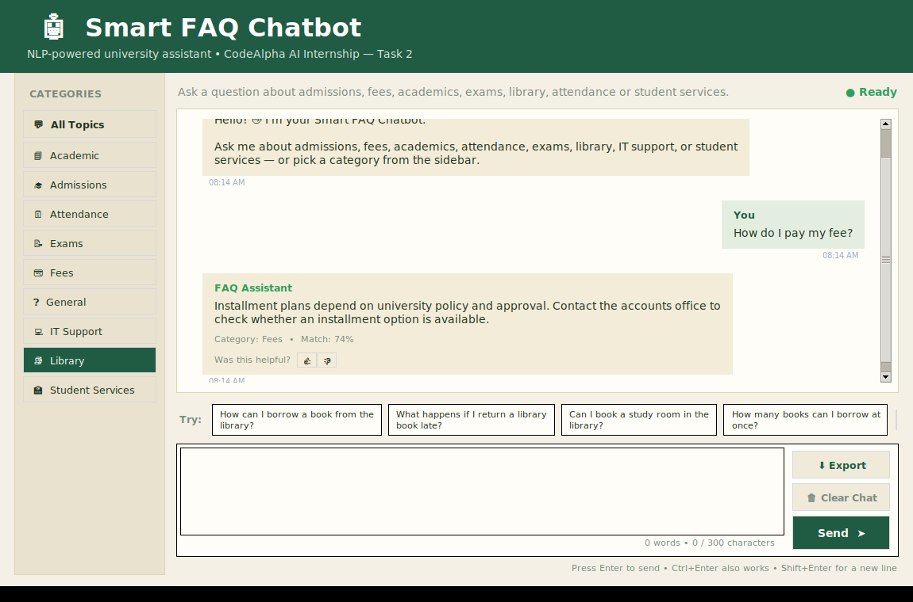

# CodeAlpha Task 2 — Smart FAQ Chatbot

A Python-based FAQ chatbot developed for the CodeAlpha Artificial Intelligence Internship.

## Project Overview

This desktop application answers common university/student questions using Natural Language Processing (NLP). It preprocesses questions with NLTK, converts FAQ questions into TF-IDF vectors using scikit-learn, and uses cosine similarity to find the most relevant FAQ answer.

## Screenshot



*Forest Green & Cream themed GUI with category sidebar, live confidence score, and feedback buttons.*

## Features

- Clean Tkinter desktop GUI with a Forest Green & Cream theme
- Branded splash/loading screen and custom app icon
- Category sidebar (Admissions, Fees, Academic, Exams, Attendance, Library, IT Support, Student Services, General)
- FAQ-based conversational interface with an animated "typing..." indicator
- NLTK text preprocessing and stemming
- TF-IDF vectorization
- Cosine similarity matching
- Similarity/confidence display
- Category display
- Smart fallback: suggests the closest matching questions when confidence is low
- Logs low-confidence ("unanswered") questions to `data/unanswered_log.json` for dataset review
- 👍 / 👎 feedback buttons on every answer, logged to `data/feedback_log.json`
- Basic Roman Urdu small talk (salam, shukriya, kaise ho, etc.)
- Rotating suggested-question chips with a refresh button
- Live word/character counter on the input box
- Export the full conversation to a `.txt` file
- Clear-chat confirmation dialog
- Scrollable chat history
- Input validation and error handling
- Easy-to-edit JSON FAQ dataset

## Technologies

- Python
- Tkinter
- NLTK
- scikit-learn
- JSON
- Git/GitHub

## Project Structure

```text
CodeAlpha_FAQ_Chatbot/
│
├── main.py
├── chatbot.py
├── requirements.txt
├── README.md
│
├── assets/
│   ├── icon.png
│   ├── icon.ico
│   └── screenshots/
│       └── main-window.png
│
└── data/
    ├── faqs.json
    ├── unanswered_log.json   (created automatically)
    └── feedback_log.json     (created automatically)
```

## Installation

1. Install Python 3.
2. Open this folder in VS Code.
3. Open the VS Code terminal.
4. Create a virtual environment (recommended):

```bash
python -m venv .venv
```

Activate it on Windows:

```bash
.venv\Scripts\activate
```

5. Install dependencies:

```bash
pip install -r requirements.txt
```

## Run

```bash
python main.py
```

## Architecture

```text
User input
    │
    ▼
[Roman Urdu small-talk check] ──match──▶ canned reply
    │ no match
    ▼
[Preprocessing] lowercase → tokenize → remove stopwords → stem (NLTK)
    │
    ▼
[TF-IDF Vectorizer] (scikit-learn, 1–2 gram)
    │
    ▼
[Cosine Similarity] vs. all FAQ question vectors
    │
    ├── score ≥ threshold ──▶ return matched FAQ answer + category + confidence
    └── score < threshold ──▶ fallback reply + top-3 closest suggestions
                               (also logged to data/unanswered_log.json)
```

## How It Works

1. The FAQ dataset contains questions, answers, and categories.
2. NLTK's Porter Stemmer normalizes important words during preprocessing.
3. scikit-learn's TF-IDF Vectorizer converts FAQ questions into numerical vectors.
4. The user's question is transformed using the same vectorizer.
5. Cosine similarity compares the user's vector with every FAQ question.
6. The highest-scoring FAQ is selected if it passes the confidence threshold.
7. If no match is reliable enough, the chatbot gives a fallback response.

## Customizing the Dataset

Open:

```text
data/faqs.json
```

Add more objects using this format:

```json
{
  "category": "Admissions",
  "question": "Your question here",
  "answer": "Your answer here."
}
```

After changing the dataset, restart the application.

## Testing Examples

Try:

- How can I apply for admission?
- I forgot my portal password
- How do I check my grades?
- What is the attendance requirement?
- Where can I find the exam schedule?
- How can I borrow a library book?
- What technologies are used in this chatbot?

Also test an unrelated question such as:

- What is the weather today?

The chatbot should use its fallback response when the similarity is below the configured threshold.

Try Roman Urdu small talk too:

- salam
- shukriya
- kaise ho

## Internship Requirements Covered

CodeAlpha Task 2 asks interns to collect FAQs, preprocess text using NLP libraries such as NLTK or SpaCy, match user questions using cosine similarity or intent matching, and display the best matching answer. This project implements those requirements with NLTK + scikit-learn + Tkinter.

## Future Improvements

- Add a larger FAQ dataset
- Add admin functionality for managing FAQs
- Add multilingual FAQ support
- Store conversations in a database
- Add a dark mode toggle
- Add voice input/output
- Add a web version using Flask or Streamlit
- Replace TF-IDF matching with a semantic embedding model

## GitHub Repository

Recommended repository name:

`CodeAlpha_FAQ_Chatbot`

## Internship Submission

Before submission, test the project from a fresh virtual environment, upload the complete source code to GitHub, and include a short project demonstration on LinkedIn as required by the internship instructions.
